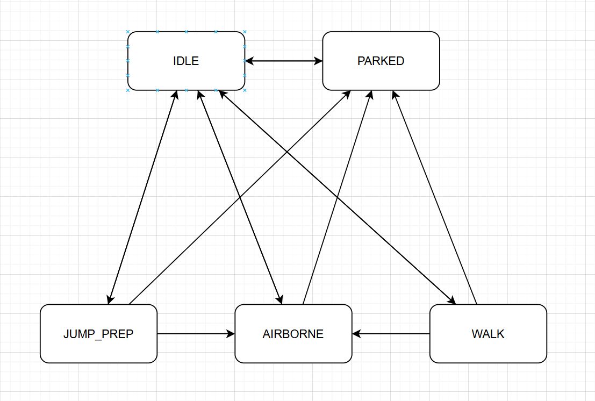

# Leap Lord — Project Overview (Unity 6)

**Project type**: 2.5D platformer inspired by Jump King (focused, one-level scope, charge-and-jump core mechanic)

**Unity version**: 6000.2.6f2

**Primary scenes**:

\- `Assets/Scenes/Start.unity`: Start/Menu

\- `Assets/Scenes/Lab.unity`: Gameplay level

**External Tools**

\- Adobe Fuse: 3D humanoid modeling

\- Adobe Mixamo: Humanoid mocap animation

\- Gimp: 2D image manipulation

\- Visual Studio: Code editor (I had some trouble with the Rider integration, so I decided to stick with what I know for now)

\- ChatGPT: Moral support, servile flattery, and occasionally answering dumb questions

## Summary

Leap Lord is a small, systems-focused recreation inspired by Jump King. The emphasis is on a single, polishable level and a single core mechanic: charging a jump and committing to its outcome. There is minimal or no mid-air control; skill comes from gauging charge strength and route planning.

### Inspiration
Nexile's [Jump King](https://en.wikipedia.org/wiki/Jump_King) is a "tactical leaping adventure" that reduces platforming to its most essential, high-stakes component: a single, chargeable jump. Players must ascend a colossal vertical tower where the only mechanic involves precisely holding a button to gauge jump height and trajectory, with no air control to correct mistakes. This deliberate design means a single miscalculation can result in a punishing fall, potentially erasing hours of progress. Its core retro appeal lies in this unforgiving, "maso-core" difficulty, demanding pure mastery and patience from the player in exchange for the immense satisfaction of each successful ascent.

---

## Systems Overview

### Input System
\- **Tech**: Unity Input System

\- **Runtime owner**: `InputHandler` singleton

\- **Role**: Centralizes player input actions (move, jump press/hold/release). Exposes a clean API to gameplay systems without scattering input logic across scripts.

\- **Script**: `Assets/Scripts/Singletons/InputHandler.cs`.

### Player Controls and State Machine
\- **Core object**: `Player` prefab, driven by a lightweight finite state machine.

\- **State framework**: `SimpleStateMachine`, `State`, `StateTransition`.

\- **Player state handlers**: Govern the behavior of the player objects in the various states:

\-`IdleStateHandler`: During unpaused gameplay, when no move or jump input is detected

\-`WalkStateHandler`: During unpaused gameplay, when move input is detected

\-`JumpPrepStateHandler`: During unpaused gameplay, when the jump input is pressed

\-`AirborneStateHandler`: During unpaused gameplay, after the jump input is released. Also when the player becomes ungrounded from the Walk or Idle states (e.g. walking off the edge of a platform).

\-`ParkedStateHandler`: When gameplay is paused and the pause/tutorial overlay UI is visible

All inherit from the abstract class StateHandler. Each has override methods to deal with the various callbacks that govern gameplay: `HandleOnEnter()`, `HandleOnExit()`, `HandleOnExit()`, `HandleUpdate()`, `HandleFixedUpdate()`, `HandleJumpPressed()`, `HandleJumpReleased()`.

\- **Key scripts**: 

&nbsp; - Player: `Assets/Scripts/Player/Player.cs`

&nbsp; - State framework: `Assets/Scripts/StateMachine/\*.cs`

\- **Mechanic**: Jump strength accumulates while holding jump. On release, the state machine applies an impulse based on charge and hands off to the airborne state. Horizontal control during flight is blocked to preserve the Jump King feel.

### Physics and Movement
\- **Physics**: Rigidbody-based motion and collisions; materials configured for character and surfaces.

\- **Forces**: Impulse on jump start; gravity dominates during airborne. Friction/bounciness via physics materials as needed.

### Camera System

\- **Scripts**: `CameraMover`, `CameraTrigger`.

\- **Behavior**: Follows the player within zones, with triggers to constrain/snap camera or adjust framing when entering new areas.

\- **Design Goals**:
\- Keep platforming challenges readable while showcasing vertical progression
\- Provide an inpsector-based interface for non-technical level designers

### Collectibles / Checkpoints

\- **Concept**: Without these, you lose all your progress when you miss a jump and fall from a great height. Spending collectible gems allow you to place checkpoint markers in the level. You can then teleport to your most-recently dropped checkpoint from anywhere in the level. The gems are a scarce and exhaustible resource though, so you need to use them strategically and judiciously.

\- **Scripts**: `CheckpointGem` handles collectible interaction in combination with `PlayerManager`. `GemManager` handles spawning and replenishing checkpoint gems from the collectible prefab.

### UI and HUD

\- **Jump Charge Bar**: `JumpStrengthProgressBar.cs` displays current jump charge to support the commit-to-jump mechanic. 

\- **Narration**: Intended to introduce the game's narrative context. The narration content is defined in `NarrationData.cs`, and its onscreen presentation is mediated by `NarrationUI.cs`

\- **Tutorial/Pause UI**: Provides gameplay onboarding, and serves as the game's pause UI. Tutorial content is defined in `TutorialData.cs`, and it's onscreen presentation is mediated by `TutorialUI.cs`

\- **HUD**: Contains buttons for pausing, quitting, and returning to the main menu. Also contains text with collectibles information.

\- **Text rendering**: TextMesh Pro with free-use fonts (1001fonts.com) in `Assets/Fonts`.

### Menus and Scene Management

\- **Start menu**: Implemented in `Start.unity`, wired via `ButtonScript` and manager calls. Detects if the game is new (`PlayerManager.IsNew`), and sets the start button text to "Continue" if not.

\- **Gameplay scene**: `Lab.unity` is the main level.

\- **Scene registry**: `Helpers/SceneNames.cs` provides a central enum/const source for scene references.

### Lazy Singletons / Managers

\- **GameManager**: Global game state and scene loading.

\- **PlayerManager**: Handles player data, and manages checkpoint gem inventory and interaction.

\- **InputHandler**: Centralized input (see Input System).

### Animation and VFX

\- **Animation**: `QuadSpriteAnimator` supports simple sprite/quads-based character animation.

\- **Asset Pipeline**: Original 2D animation frames created using a custom pipeline discussed in detail on the GP25 Discord channel [(message link)](https://discord.com/channels/1414564984569991312/1414565557205995671/1432711934783787132)

\- **VFX**: Teleport/transition effects via `TeleportEffect` and `TeleportEffectPrefab` plus materials/shaders.

### Utilities and Helpers

\- **Helpers**: `EnumLeoAnimations`, `Tags`, `NarrationNames` — central enums/constants intended to reduce the need for string literals elsewhere in the game.

---

## How to Play (Editor)

1\) Open `Assets/Scenes/Start.unity`. 

2\) Set the Game window to 1920:1080 resolution, and press Play.

3\) Use keyboard/controller per Input System bindings to move, hold jump to charge, and release to commit to the jump. The in-game onboarding routine will cover this.

4\) Watch the jump bar for charge strength. Collect gems and drop checkpoints as you progress upward.

## Future Work / Nice-to-haves

\- More skillful and challenging level design. What's here now is a bare minimum, intended only to demonstrate the core mechanics.

\- Add sound effects and simple background music.

\- Expand hazard variety and add a small enemy type with patrol AI.

\- Add optional power-up that temporarily modifies jump charge rate or max strength, or allows minimal horizontal control while airborne.

\- Polish camera transitions across tall vertical sections.
